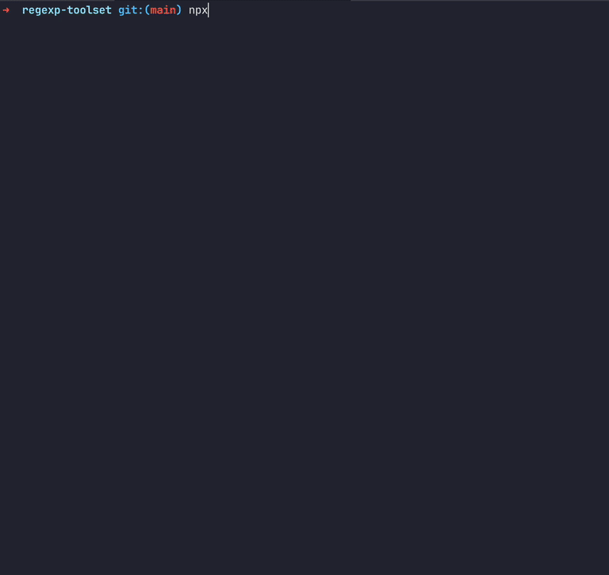

# Regexp explainer

CLI util for generating comprehensive report about regexp.
Powered by [ECMA-262 Regexp parser](../ecma-262-regexp-parser)



Requires `Node >= 16`

## Usage

You can install package through your package manager or use in directly with `npx`

### Installation
```shell
$ npm i explain-regexp -g
```
```shell
$ yarn global add explain-regexp
```
```shell
$ pnpm install --global explain-regexp
```

### CLI
Create report about full regexp:
```shell
$ explain-regexp "/[A-z]+/gm"
```

Create report about part of regexp:
```shell
$ explain-regexp part "(?:Hello)"
```

#### options
  * `--color` `--no-color` forces colors on/off, default behavior depends on env;
  * `-d, --debug` shows full error stacktrace;
